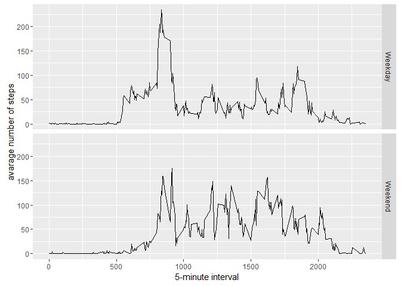

# Reproducible Research: Peer Assessment 1


## Loading and preprocessing the data


```r
activity <- read.csv("./activity.csv", stringsAsFactors=FALSE)
str(activity)
```

```
## 'data.frame':	17568 obs. of  3 variables:
##  $ steps   : int  NA NA NA NA NA NA NA NA NA NA ...
##  $ date    : chr  "2012-10-01" "2012-10-01" "2012-10-01" "2012-10-01" ...
##  $ interval: int  0 5 10 15 20 25 30 35 40 45 ...
```

```r
summary(activity)
```

```
##      steps            date              interval     
##  Min.   :  0.00   Length:17568       Min.   :   0.0  
##  1st Qu.:  0.00   Class :character   1st Qu.: 588.8  
##  Median :  0.00   Mode  :character   Median :1177.5  
##  Mean   : 37.38                      Mean   :1177.5  
##  3rd Qu.: 12.00                      3rd Qu.:1766.2  
##  Max.   :806.00                      Max.   :2355.0  
##  NA's   :2304
```

## What is mean total number of steps taken per day?

```r
library(ggplot2)
stepsByDay <- aggregate(steps ~ date, activity, sum)
hist(stepsByDay$steps, main = paste("Total Steps Each Day"), col="blue", xlab="Number of Steps")
```


```r
rmean <- mean(stepsByDay$steps,na.rm=TRUE)
rmedian <- median(stepsByDay$steps, na.rm=TRUE)
```
* Mean: 1.0766189\times 10^{4}
* Median:  10765

## What is the average daily activity pattern?


```r
averages <- aggregate(x=list(steps=activity$steps), by=list(interval=activity$interval),
                      FUN=mean, na.rm=TRUE)
ggplot(data=averages, aes(x=interval, y=steps)) +
    geom_line() +
    xlab("5-minute interval") +
    ylab("average number of steps taken")
```


## Imputing missing values


```r
missing <- is.na(activity$steps)
# How many missing
table(missing)
```

```
## missing
## FALSE  TRUE 
## 15264  2304
```


```r
fill.value <- function(steps, interval) {
    filled <- NA
    if (!is.na(steps))
        filled <- c(steps)
    else
        filled <- (averages[averages$interval==interval, "steps"])
    return(filled)
}
filled.data <- activity
filled.data$steps <- mapply(fill.value, filled.data$steps, filled.data$interval)
```


```r
total.steps <- tapply(filled.data$steps, filled.data$date, FUN=sum)
qplot(total.steps, binwidth=1000, xlab="total number of steps taken each day")
```


```r
mean(total.steps)
```

```
## [1] 10766.19
```

```r
median(total.steps)
```

```
## [1] 10766.19
```

## Are there differences in activity patterns between weekdays and weekends?


```r
Sys.setlocale("LC_TIME", "English")
```

```
## [1] "English_United States.1252"
```

```r
weekdays <- c("Monday", "Tuesday", "Wednesday", "Thursday", 
              "Friday")
activity$dow = as.factor(ifelse(is.element(weekdays(as.Date(activity$date)),weekdays), "Weekday", "Weekend"))
steps_by_interval_i <- aggregate(steps ~ interval + dow, activity, mean)
```

```r
ggplot(steps_by_interval_i, aes(interval, steps)) + 
    geom_line() + 
    facet_grid(dow ~ .) +
    xlab("5-minute interval") + 
    ylab("avarage number of steps")
```


